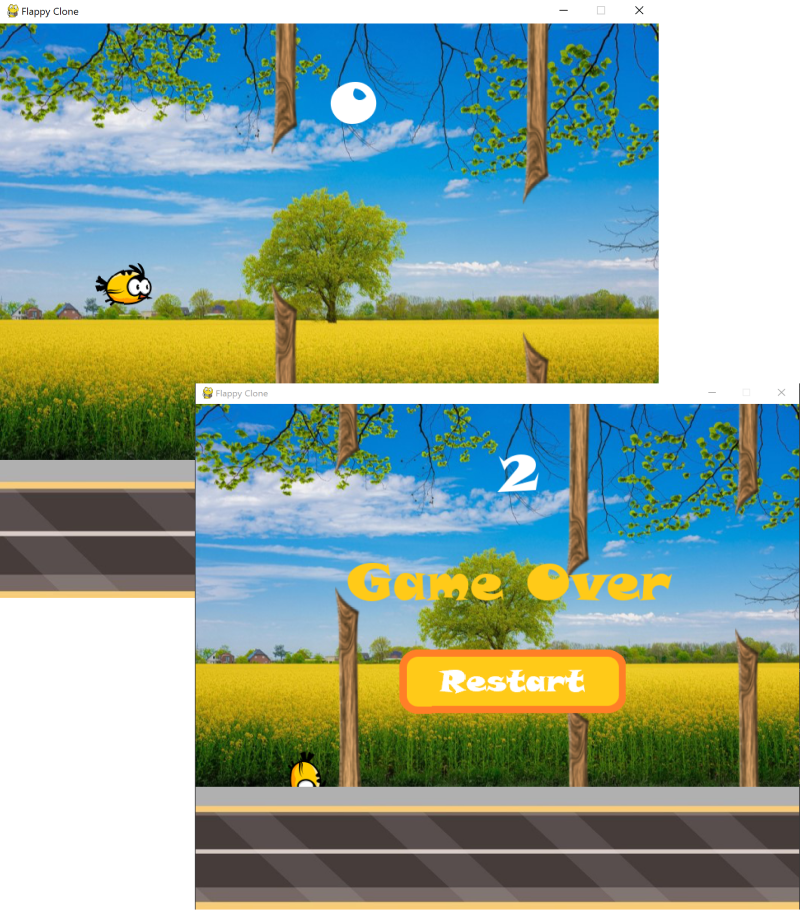

# Flappy Bird - a pygame demo of the infamous game that was originally created by the Vietnamese programmer Dong Nguyen.

  Pygame Demo by <a href="https://iceeqsolutions.fi/">iCeeqSolutions</a>

## About

This Flappy Bird clone was created to demo and test out the pygame module set.

Games starts when the player clicks the left mouse button. During game play, the left mouse button is also used to increase Flappy's altitude. For each cleared obstacle, the player score is increased by one point.

## Demo

To test out the game, download the repository and use pip to install pygame:
python3 -m pip install -U pygame --user

## Built with

- Python
- Pygame module

## Features

- Python classes
- Python functions
- Pygame sprite classes

  

  
